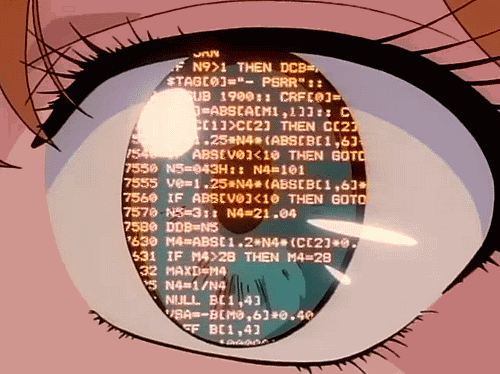

<h2 align="center">⭐ 𝓐𝓫𝓸𝓾𝓽 𝓶𝓮   ⭐</h2>

  

  <li><b>Name: Max</b></li>
  <li><b>Age: 19 y.o</b></li>
  <li><b>Residence: Germany</b></li>
  <li><b>Hobbys: Tech Stuff, Programming</b></li>
  <li><b>Upcoming: ...</b></li>
    
      

    <h2>📚 𝙆𝙣𝙤𝙬𝙡𝙚𝙙𝙜𝙚 📚</h2>

    
       

  

<h1 align="center">𝗦𝗢𝗖𝗜𝗔𝗟𝗦</h1>

  
  
   
  

<h2 align="center">👋 またね 👋</h2>

  
